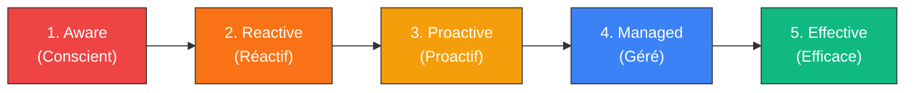
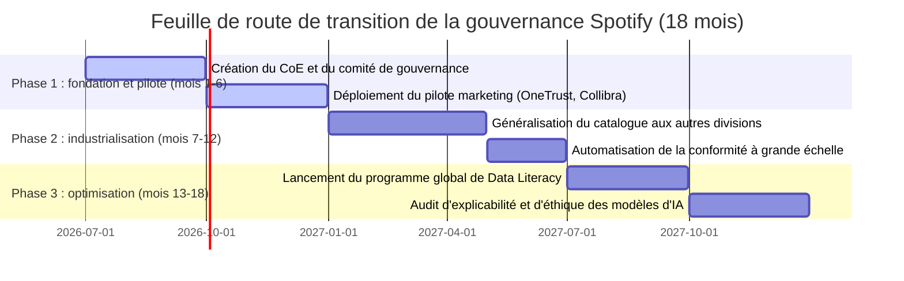

# Livrable 1 : rapport d'évaluation de la maturité des données de Spotify
## Certification architecte en IA (RNCP 38777 - bloc 1)
### Cas d'étude : Spotify Technology S.A.

**Auteur :** Caroline Heymes  
**Date :** 9 juin 2026  

---

## Table des matières
1. **Introduction et objectifs du diagnostic**
2. **Méthodologie d'évaluation de la maturité (modèles Gartner et DAMA)**
3. **Analyse détaillée des neuf dimensions**
   * *3.1. Gouvernance des données (data governance)*
   * *3.2. Qualité des données (data quality)*
   * *3.3. Architecture des données (data architecture)*
   * *3.4. Conformité réglementaire (compliance)*
   * *3.5. Utilisation et accessibilité des données (data usage & accessibility)*
   * *3.6. Sécurité des données (data security)*
   * *3.7. Culture de la donnée (data literacy)*
   * *3.8. Intégration des données (data integration)*
   * *3.9. Analyses et business intelligence (analytics & BI)*
4. **Tableau de synthèse de la maturité**
5. **Feuille de route de transition (moyen terme)**
6. **Conclusion**

---

## 1. Introduction et objectifs du diagnostic

Ce diagnostic évalue la maturité des données de Spotify Technology S.A. en se fondant notamment sur les enseignements de sa transition stratégique historique amorcée en 2020. L'objectif est de concevoir un cadre de gouvernance adapté à un modèle de streaming à l'échelle mondiale et à des ambitions avancées en matière d'intelligence artificielle.

### Le contexte économique et technologique
Avec plus de 450 millions d'utilisateurs actifs, dont 200 millions d'abonnés Premium répartis dans 180 pays, Spotify gère quotidiennement des volumes de données de l'ordre de l'exaoctet, représentant le traitement de plus de **500 milliards d'événements par jour** (Source officielle : *Spotify Engineering Blog*, 2019 : *"Observability at Scale: Run-time modeling of Spotify’s event delivery"*, faisant état d'un pic à plus de 500 milliards de messages quotidiens transitant par Google Cloud Pub/Sub). Sa position de leader repose historiquement sur sa capacité à personnaliser l'expérience utilisateur grâce à des modèles d'apprentissage automatique sophistiqués comme *Discover Weekly* ou *Daily Mix*.

### Les limites de l'hyper-croissance et de la migration  cloud
Le passage intégral au cloud et l'explosion massive du nombre de jeux de données en 2020 ont mis en évidence la fragilité du modèle décentralisé traditionnel. La liberté historique accordée aux équipes d'ingénierie autonomes (les "Squads") a engendré une forte fragmentation : prolifération de ressources techniques sans propriétaire identifié (*orphan datasets*), incohérences sémantiques majeures, duplication inutile des pipelines de calcul (Green IT dégradé), et difficultés d'exploration sémantique pour les analystes métiers. Ce cloisonnement fragilise à la fois la qualité des modèles d'IA, la conformité réglementaire de masse (RGPD, CCPA, PDPA) et l'accessibilité globale des données.

### Objectifs de l'évaluation
Ce document établit un état des lieux et quantifié de la gestion des données chez Spotify sur neuf dimensions stratégiques. En positionnant chaque domaine sur l'échelle de maturité de Gartner (niveaux 1 à 5), nous définissons les bases d'un plan de remédiation pragmatique, aligné sur les exigences académiques et professionnelles d'un niveau bac+5.

---

## 2. Méthodologie d'évaluation (modèles Gartner et DAMA)

Pour structurer ce diagnostic, nous croisons le modèle de maturité de la gouvernance de Gartner avec le référentiel de connaissances du DAMA-DMBOK2. L'évaluation positionne chaque dimension sur une échelle à cinq niveaux :

*   **Niveau 1 - Aware (Conscient)** : l'importance de la donnée est comprise de manière informelle, mais aucune politique ni outil n'est structuré.
*   **Niveau 2 - Reactive (Réactif)** : les problèmes de données sont résolus au coup par coup lors des crises. Il n'y a pas de budget transverse dédié.
*   **Niveau 3 - Proactive (Proactif)** : des processus locaux existent et la qualité est surveillée dans certains départements. Début de collaboration transverse.
*   **Niveau 4 - Managed (Géré)** : des politiques de gouvernance globales sont partagées, respectées et outillées à l'échelle de l'entreprise.
*   **Niveau 5 - Effective (Efficace)** : la gouvernance est automatisée, intégrée à la culture d'entreprise, et sert de levier direct d'innovation et de création de valeur financière.

---

## 3. Analyse détaillée des neuf dimensions

### 3.1. Gouvernance des données (data governance)
*   **Score actuel** : Niveau 2 (Reactive)
*   **Observations et diagnostic** : Spotify souffre historiquement d'une fragmentation de ses politiques de gouvernance due à l'indépendance de ses Squads de développement. Bien que les rôles stratégiques de Chief Data Officer (CDO) et de Data Protection Officer (DPO) soient établis, la gestion opérationnelle est restée longtemps éclatée, menant à une accumulation massive d'actifs sans propriétaire identifié (*orphan datasets*).
*   **Atouts** :
    *   Présence d'un CDO et d'un DPO d'envergure globale.
    *   Transition majeure amorcée pour intégrer la gouvernance directement dans le quotidien des développeurs, éliminant ainsi toute bureaucratie externe ou validation manuelle lente.
*   **Limites et risques** :
    *   Absence d'un comité de gouvernance fédéré pour harmoniser la sémantique et arbitrer les litiges de partage entre domaines métiers.
    *   Risque d'anarchie technique et de prolifération de pipelines redondants si l'alignement n'est pas géré au niveau de la "flotte" globale des données.
*   **Actions correctives prioritaires** :
    *   Créer un comité de gouvernance des données (Gouvernance Fédérée) pour superviser l'ensemble de la "flotte" technique.
    *   Intégrer la déclaration de propriété obligatoire directement dans le cycle de vie logiciel via des fichiers déclaratifs `owner.yaml` enregistrés sous Git, liant de fait chaque ressource à une équipe.
    *   S'appuyer sur le portail développeur centralisé **Backstage** pour visualiser en temps réel la cartographie des propriétaires et éliminer définitivement les ressources orphelines.
    *   Clarifier les rôles : les chefs de produits définissent les besoins sémantiques et d'accès, tandis que les ingénieurs d'ingénierie logicielle conçoivent et exécutent les pipelines techniques associés.

---

### 3.2. Qualité des données (data quality)
*   **Score actuel** : Niveau 3 (Proactive - tendance locale)
*   **Observations et diagnostic** : la qualité des données de facturation est maîtrisée, mais les métadonnées musicales (genres, artistes, labels) et les données de navigation d'écoute à grande échelle souffrent d'irrégularités. Les erreurs d'écriture polluent le lac de données et nuisent à la précision des algorithmes.
*   **Atouts** :
    *   Surveillance étroite des données critiques de transaction financière.
    *   Utilisation du concept innovant de **gouvernance de flotte** (*fleet management*), mesurant en continu l'alignement des pipelines sur des états de référence validés (**Golden States**).
*   **Limites et risques** :
    *   Des métadonnées erronées dégradent l'expérience utilisateur (sauts de pistes erratiques) et polluent l'entraînement des modèles de recommandation.
    *   Les validations manuelles de qualité créeraient des goulots d'étranglement inacceptables pour les équipes autonomes d'ingénierie.
*   **Actions correctives prioritaires** :
    *   Généraliser le système d'alignement automatique et continu par rapport aux **Golden States** technologiques (versions logicielles à jour, schémas de validation, conformité de lignage).
    *   Déployer des plugins d'indicateurs de santé de données directement au sein de **Backstage**, permettant aux équipes de suivre visuellement et en temps réel le score de qualité (*data health*) de leurs pipelines de données.
    *   Mettre en place des mécanismes de rejet et d'isolation automatique à l'entrée des pipelines (*Schema-on-Write* avec Kafka/Avro) pour éviter la contamination du lac de données.

---

### 3.3. Architecture des données (data architecture)
*   **Score actuel** : Niveau 3 (Proactive)
*   **Observations et diagnostic** : l'infrastructure cloud (GCP) et de traitement en temps réel de Spotify est extrêmement puissante. Cependant, la migration intégrale vers le cloud s'est traduite par une multiplication exponentielle des tables et des schémas d'intégration, créant une fragmentation qui nuit à la traçabilité des données d'écoute et de navigation.
*   **Atouts** :
    *   Infrastructure capable d'absorber des volumes massifs (des centaines de milliards d'événements par jour).
    *   Modernisation des métadonnées à travers un catalogue intelligent et d'une architecture décentralisée de type Data Mesh en libre-service.
*   **Limites et risques** :
    *   La sur-décentralisation technique crée un fossé sémantique entre la disponibilité pure de la donnée et son exploitation concrète par les analystes métiers.
    *   Une mauvaise traçabilité (*lineage*) complexifie l'analyse d'impact des pannes ou des modifications de structure sur l'ensemble de la flotte de données.
*   **Actions correctives prioritaires** :
    *   Faire évoluer le catalogue interne d'un simple répertoire passif de métadonnées vers un **moteur de recommandation intelligent**, capable de comprendre l'intention sémantique de l'utilisateur lors de ses recherches.
    *   Mettre en œuvre des mécanismes de **sémantique sociale** : coupler systématiquement les jeux de données catalogués avec les messageries d'équipe (comme **Slack**) afin d'identifier, de cartographier et de contacter en temps réel les experts humains associés à chaque domaine de données.
    *   Renforcer la traçabilité sémantique de bout en bout (lineage automatique) pour documenter la dérivation des événements bruts d'écoute jusqu'aux modèles analytiques avancés.

---

### 3.4. Conformité réglementaire (compliance)
*   **Score actuel** : Niveau 3 (Proactive - tendance Managed)
*   **Observations et diagnostic** : Spotify est soumis à de multiples régulations (RGPD en Europe, CCPA en Californie, PDPA à Singapour). Si l'affichage de surface et les formulaires de consentement sont opérationnels, l'exécution interne à grande échelle des droits de suppression (droit à l'oubli) et d'extraction représentait un défi opérationnel majeur à l'échelle de l'exaoctet.
*   **Atouts** :
    *   Équipes juridique et technique (DPO) structurées travaillant en étroite synergie.
    *   Automatisation complète des processus de confidentialité liée directement au cycle de vie technique des données.
*   **Limites et risques** :
    *   L'absence de suppression automatisée au niveau de l'infrastructure risquerait d'entraîner des goulots d'étranglement manuels ou des oublis de purge dans les sauvegardes.
    *   Risque d'amendes administratives massives de la part d'autorités de contrôle (jusqu'à 20 M€ ou 4% du chiffre d'affaires mondial) en cas d'incohérence technique.
*   **Actions correctives prioritaires** :
    *   Implémenter un système automatisé de **chiffrement KMS au niveau des colonnes** pour toutes les données hautement sensibles (PII), associé à une rotation continue des clés de sécurité pour garantir la protection au repos.
    *   Intégrer les politiques de rétention et de suppression directement sous forme de règles logicielles automatisées liées au cycle de vie de la ressource, assurant la destruction ou l'anonymisation irréversible des données d'écoute obsolètes de manière transparente.
    *   Fédérer ces API d'infrastructure avec la plateforme d'orchestration **OneTrust** pour automatiser en temps réel le traitement des demandes des utilisateurs européens.

---

### 3.5. Utilisation et accessibilité des données (data usage & accessibility)
*   **Score actuel** : Niveau 3 (Proactive)
*   **Observations et diagnostic** : l'accès aux données brutes est fluide pour les profils techniques (Data Engineers, Data Scientists). En revanche, l'accès à des données analytiques documentées et agrégées est difficile pour les équipes opérationnelles (marketing, gestionnaires de contenu, finance), ce qui ralentit les décisions stratégiques.
*   **Atouts** :
    *   Accès direct aux données via GCP BigQuery pour les équipes techniques.
    *   Forte culture analytique au sein de la R&D.
*   **Limites et risques** :
    *   Les équipes métiers dépendent de l'ingénierie pour obtenir des extractions, ce qui génère des délais de traitement de plusieurs jours.
    *   Manque de documentation des données métiers, favorisant les erreurs d'interprétation dans les rapports.
*   **Actions correctives prioritaires** :
    *   Déployer un portail de Business Intelligence en self-service (Tableau, PowerBI ou Looker) connecté à des tables certifiées par la gouvernance.
    *   Documenter les définitions des termes métiers clés dans le dictionnaire du catalogue central.

---

### 3.6. Sécurité des données (data security)
*   **Score actuel** : Niveau 4 (Managed)
*   **Observations et diagnostic** : la sécurité est la dimension la plus mature chez Spotify. L'infrastructure applique un chiffrement systématique des données sensibles au repos et en transit (AES-256 et TLS 1.3). Les serveurs gérant les abonnements Premium respectent les normes PCI-DSS. Des contrôles d'accès stricts limitent l'accès aux infrastructures physiques.
*   **Atouts** :
    *   Chiffrement généralisé sur l'ensemble de la plateforme.
    *   Conformité continue aux normes de paiement PCI-DSS.
    *   Utilisation de protocoles stricts de gestion des identités.
*   **Limites et risques** :
    *   Certains ingénieurs disposent d'accès trop larges à des tables contenant des données d'utilisateurs pseudonymisées, ce qui augmente la surface d'attaque en cas de compromission d'identité.
*   **Actions correctives prioritaires** :
    *   Mettre en œuvre une politique d'accès basée sur les rôles (RBAC) et appliquer strictement le principe du moindre privilège.
    *   Centraliser et analyser les logs d'accès aux bases de données sensibles en temps réel via un outil SIEM (Splunk).

---

### 3.7. Culture de la donnée (data literacy)
*   **Score actuel** : Niveau 3 (Proactive)
*   **Observations et diagnostic** : il existe une asymétrie culturelle chez Spotify. Alors que l'ingénierie et la R&D possèdent un excellent niveau technique, la culture de la gouvernance et de la conformité éthique doit être harmonisée. De plus, les équipes opérationnelles (marketing, finances) ont besoin de renforcer leur autonomie dans la manipulation correcte des données.
*   **Atouts** :
    *   Excellente culture technique d'ingénierie logicielle et d'IA.
    *   Prise de conscience de la nécessité d'associer un solide volet éducatif interne aux efforts d'outillage technique.
*   **Limites et risques** :
    *   Si la conformité et la gouvernance sont perçues comme des contraintes purement administratives ou centralisées par l'IT, cela créera une forte résistance au sein des Squads.
    *   Asymétrie de connaissances sur le RGPD ou la gestion éthique des données entre les ingénieurs techniques et les chefs de produits métiers.
*   **Actions correctives prioritaires** :
    *   Lancer un programme d'éducation et de montée en compétence transverse, garantissant que les directeurs d'ingénierie (*engineering managers*) et les directeurs de produits (*product managers*) partagent le même socle de connaissances rigoureuses sur la gouvernance.
    *   Rendre la formation aux politiques de cycle de vie et de sécurité des données obligatoire pour toute nouvelle recrue technique ou produit.
    *   Organiser des ateliers d'acculturation sémantique pour rapprocher les experts techniques de la sémantique métier des analystes.

---

### 3.8. Intégration des données (data integration)
*   **Score actuel** : Niveau 2 (Reactive)
*   **Observations et diagnostic** : l'intégration transversale est l'un des points faibles de l'organisation. Pour retracer le parcours complet d'un utilisateur — de sa première exposition publicitaire à sa navigation sur l'application gratuite jusqu'à sa conversion Premium —, les équipes doivent croiser manuellement des données issues de bases hétérogènes.
*   **Atouts** :
    *   Pipelines temps réel performants pour l'ingestion locale de chaque application.
*   **Limites et risques** :
    *   L'absence de vision à 360° du parcours client freine l'optimisation des campagnes d'acquisition d'abonnés.
    *   La duplication des données et des calculs entre les équipes augmente les coûts d'hébergement cloud et l'empreinte carbone (Green IT).
*   **Actions correctives prioritaires** :
    *   Créer un pipeline d'intégration transverse unifiant les données de marketing, de navigation et de facturation.
    *   Déployer des outils d'intégration modernes (Talend ou orchestration via Apache Airflow) garantissant un suivi de la traçabilité (*data lineage*).

---

### 3.9. Analyses et business intelligence (analytics & BI)
*   **Score actuel** : Niveau 5 (Effective)
*   **Observations et diagnostic** : c'est le principal moteur de croissance de Spotify. L'entreprise valorise les données d'écoute à grande échelle pour concevoir des produits à forte valeur ajoutée. L'algorithme *Discover Weekly* et la campagne annuelle de bilan personnalisé *Spotify Wrapped* (succès d'engagement mondial) témoignent d'une excellence technique incontestable.
*   **Atouts** :
    *   Savoir-faire de niveau mondial en Machine Learning et filtrage collaboratif.
    *   La donnée est valorisée comme un produit stratégique (*Data as a Product*).
*   **Limites et risques** :
    *   La performance des modèles prédictifs est limitée à la source par les silos d'intégration et l'inconstance de la qualité des métadonnées musicales.
*   **Actions correctives prioritaires** :
    *   Garantir l'explicabilité (Explainable AI - XAI) des modèles de recommandation pour prévenir les biais éthiques ou d'exclusion.
    *   Connecter les pipelines d'entraînement des modèles directement aux tables certifiées par le nouveau cadre de gouvernance.

---

## 4. Tableau de synthèse de la maturité

Le tableau ci-dessous résume la maturité actuelle de Spotify sur les neuf dimensions clés de Gartner, ainsi que la cible visée à 18 mois après le déploiement du programme de gouvernance orchestré par le Centre d'Excellence (CoE).

| Dimension de la gouvernance | Score actuel | Cible à 18 mois | Écart (Gap) | Risque principal associé à l'inaction |
| :--- | :---: | :---: | :---: | :--- |
| **Gouvernance des données** | 2 | 4 | +2 | Décisions stratégiques incohérentes, conflits d'autorité sur les données. |
| **Qualité des données** | 3 | 4 | +1 | Dégradation des recommandations de l'IA (sauts de chansons). |
| **Architecture des données** | 3 | 4 | +1 | Prolifération des silos, coûts d'hébergement cloud incontrôlés. |
| **Conformité réglementaire** | 3 | 5 | +2 | Risque d'amende s'levant à 4 % du chiffre d'affaires mondial (RGPD). |
| **Utilisation et accessibilité** | 3 | 4 | +1 | Ralentissement des décisions, goulots d'étranglement sur l'ingénierie. |
| **Sécurité des données** | 4 | 5 | +1 | Violation de données personnelles de masse, failles de sécurité. |
| **Culture de la donnée** | 3 | 4 | +1 | Erreurs d'analyses métiers, résistance forte face aux nouveaux processus. |
| **Intégration des données** | 2 | 4 | +2 | Absence de vision à 360° de l'utilisateur, duplication des efforts techniques. |
| **Analyses et BI** | 5 | 5 | 0 | Perte de compétitivité face aux autres services de streaming (Apple Music). |

---

## 5. Feuille de route de transition (moyen terme)

Pour combler ces écarts de maturité sans ralentir le rythme de livraison des équipes d'ingénierie, nous proposons une feuille de route structurée en trois phases progressives sur 18 mois :

---

## 6. Conclusion

L'évaluation de la maturité des données chez Spotify met en évidence un paradoxe fréquent chez les géants de la technologie : une excellence opérationnelle sur la couche de valorisation finale (les analyses et l'IA, notées 5/5), contrastant avec des fragilités structurelles sur les fondations de base (gouvernance et intégration, notées 2/5).

Ce déséquilibre expose l'entreprise à des risques cyber, juridiques et financiers non négligeables, tout en limitant la performance de ses algorithmes en raison de la qualité inconstante des données à la source.

La structuration immédiate d'un cadre unifié de gouvernance des données, piloté par un Centre d'Excellence (CoE) indépendant, constitue la réponse idoine pour sécuriser les infrastructures de Spotify, automatiser sa conformité réglementaire et pérenniser son avantage concurrentiel.
