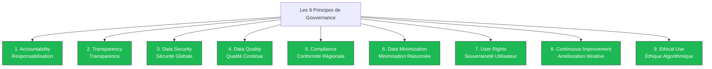
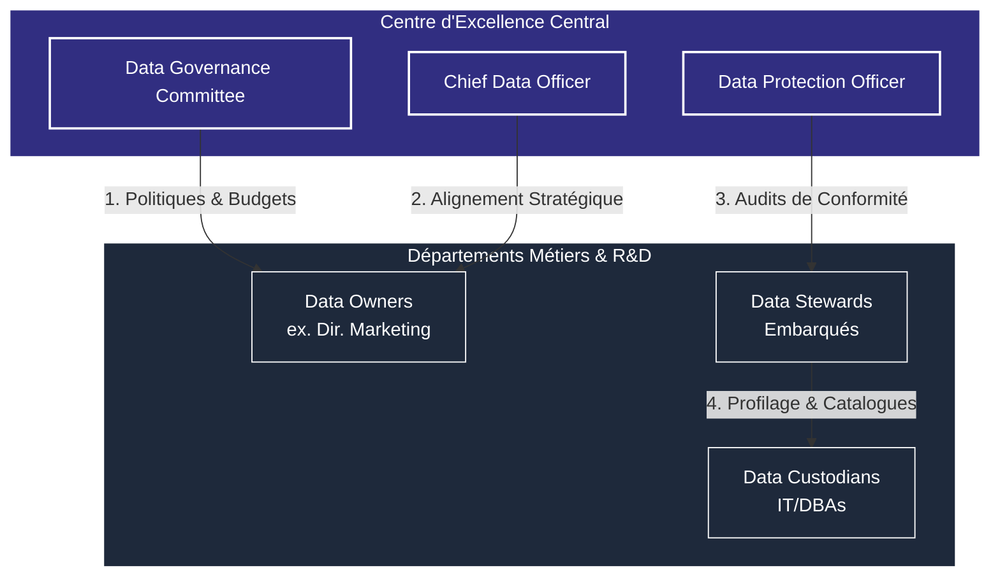
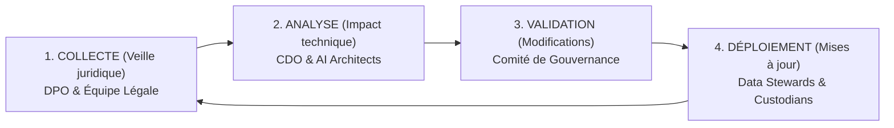

    <h1>Livrable 2 : charte globale de politique de gouvernance des données</h1>
    <h2>Certification architecte en IA (RNCP 38777 - bloc 1) • Charte d'organisation des pouvoirs</h2>
    

        <strong>Auteur :</strong> Caroline Heymes
        <strong>Date :</strong> 9 juin 2026
        <strong>Statut :</strong> Livrable 2 (Version v2 Compacte)
    

## Table des matières
1. **Objet de la charte et cadre de référence**
2. **Les neuf principes fondamentaux de la gouvernance de Spotify**
3. **Modèle de gouvernance et organisation des pouvoirs (rôles et responsabilités)**
4. **Cadre de conformité légale (RGPD, CCPA, PCI-DSS)**
5. **Accessibilité numérique et inclusion des personnes en situation de handicap (RGAA et WCAG)**
6. **Veille réglementaire continue et procédures de mise à jour**
7. **Conclusion**

---

## 1. Objet de la charte et cadre de référence

Cette charte définit le cadre réglementaire, organisationnel et technique applicable à l'ensemble des actifs de données de Spotify Technology S.A. dans ses 180 pays d'opération.

### Fondements théoriques
Cette politique s'appuie sur deux référentiels d'autorité en matière de gestion des données et de sécurité de l'information :
*   Le cadre méthodologique **DAMA-DMBOK2** (*Data Management Body of Knowledge*) pour structurer les domaines de connaissances de la gestion de données.
*   La norme **ISO/IEC 27001:2022** pour la mise en œuvre du Système de Management de la Sécurité de l'Information (SMSI).

---

## 2. Les neuf principes fondamentaux de la gouvernance de Spotify

Pour guider l'action des équipes et concilier l'innovation technologique avec la protection des utilisateurs, Spotify retient neuf principes directeurs :

    Livrable 2 : charte globale de politique de gouvernance des données
    <strong>Page 1 / 4</strong>

1.  **Responsabilisation (Accountability)** : chaque donnée collectée ou traitée doit être rattachée à un propriétaire identifié (*Data Owner*) et supervisée par un gestionnaire (*Data Steward*).
2.  **Transparence (Transparency)** : Spotify explique de manière claire et intelligible comment les données d'écoute, de recherche et de profil sont exploitées par les modèles d'IA.
3.  **Sécurité globale (Data Security)** : les données sont protégées par un chiffrement fort (AES-256 au repos, TLS 1.3 en transit) et un cloisonnement strict des bases financières certifiées PCI-DSS.
4.  **Qualité continue (Data Quality)** : l'exactitude de nos catalogues étant essentielle pour les recommandations, des audits et règles de nettoyage automatique des métadonnées sont exécutés en ligne lors de l'ingestion.
5.  **Conformité régionale (Compliance)** : alignement sur les législations territoriales les plus protectrices (RGPD en Europe, CCPA aux États-Unis, PDPA à Singapour ou en Malaisie).
6.  **Minimisation raisonnée (Data Minimization)** : collecter uniquement les données d'écoute et de comportement nécessaires au service de streaming, et purger automatiquement les logs bruts après 24 mois d'inactivité.
7.  **Souveraineté de l'utilisateur (User Rights)** : garantir à chaque abonné un contrôle direct et automatisé sur ses droits légaux (accès, modification, suppression de compte) depuis l'interface de l'application.
8.  **Amélioration itérative (Continuous Improvement)** : évaluer périodiquement les pratiques de gouvernance pour les adapter aux avancées de l'intelligence artificielle et aux évolutions juridiques.
9.  **Éthique algorithmique (Ethical Use)** : surveiller en continu les réseaux de neurones pour détecter et corriger les biais d'exclusion d'artistes ou les stéréotypes de genres musicaux.

---

## 3. Modèle de gouvernance et organisation des pouvoirs

Pour éviter les conflits d'intérêts où les équipes techniques évaluent leurs propres réalisations, Spotify retient une structure de gouvernance fédérée asynchrone. Ce modèle est piloté par un Centre d'Excellence (CoE) indépendant de la direction informatique (DSI).

### Rôles et responsabilités du programme (CDO, DPO, Comité)
*   **Chief Data Officer (CDO)** :  
    *   *Mission principale* : diriger la stratégie de valorisation de la donnée et présider le comité de gouvernance.
    *   *Responsabilités* : allouer les budgets technologiques transverses, arbitrer les écarts sémantiques entre départements, et évaluer la valeur économique des actifs d'information.
*   **Data Protection Officer (DPO)** :  
    *   *Mission principale* : garantir la conformité juridique et la protection de la vie privée des abonnés.
    *   *Responsabilités* : mener les analyses d'impact sur la vie privée (AIPD), assurer la liaison avec la CNIL et les régulateurs internationaux, et coordonner le protocole de gestion des incidents de données.
*   **Data Governance Committee (Comité de gouvernance)** :  
    *   *Mission principale* : valider les politiques transversales et superviser l'évaluation continue de la maturité data.
    *   *Composition* : CDO (Président), DPO, directeurs de l'ingénierie, du marketing, de la R&D IA et de la finance.

    Livrable 2 : charte globale de politique de gouvernance des données
    <strong>Page 2 / 4</strong>

*   **Data Owner (Propriétaire métier ou de domaine)** :  
    *   *Mission principale* : garantir la définition sémantique, la qualité d'usage et la conformité éthique de son domaine de données (ex. le directeur produit pour la base des abonnés).
    *   *Responsabilités* : Dans l'approche décentralisée de Spotify, chaque propriétaire déclare et maintient obligatoirement la propriété technique de ses ressources via un fichier déclaratif `owner.yaml` stocké directement dans le dépôt Git associé. Ce fichier est interprété par le portail développeur **Backstage** pour cartographier et éliminer automatiquement les ressources orphelines.
*   **Data Steward (Gestionnaire opérationnel embarqué)** :  
    *   *Mission principale* : agir au cœur des Squads de développement pour traduire les directives du comité de gouvernance en configurations techniques concrètes.
    *   *Responsabilités* : documenter les jeux de données d'écoute et de navigation, valider les règles de qualité continue, et veiller à la conformité des pipelines techniques en les comparant aux états de référence de la flotte (**Golden States**).
*   **Data Custodian (Gardien technique d'ingénierie)** :  
    *   *Mission principale* : concevoir et opérer l'infrastructure physique et cloud de stockage et de calcul (Data Engineers, SREs).
    *   *Responsabilités* : configurer les serveurs GCP (BigQuery, Cloud Storage), administrer les micro-services d'API de confidentialité, appliquer les règles de chiffrement KMS au niveau des colonnes, et exécuter les scripts automatisés de gestion du cycle de vie des ressources.

---

## 4. Cadre de conformité légale (RGPD, CCPA, PCI-DSS)

La conformité chez Spotify est conçue comme un processus automatisé, intégré directement dans nos pipelines d'ingestion et de traitement des données.

### 4.1. Principes de traitement du RGPD
Toute équipe concevant un produit de données ou entraînant un modèle d'IA chez Spotify doit respecter trois principes clés de l'article 5 du RGPD :
1.  **Légalité (Lawfulness)** : chaque traitement s'appuie sur une base légale définie (exécution du contrat pour le streaming, consentement pour le profilage publicitaire, intérêt légitime pour la détection des fraudes d'abonnements).
2.  **Loyauté (Fairness)** : l'algorithme ne doit pas manipuler l'utilisateur de manière biaisée ou trompeuse pour augmenter artificiellement son temps d'écoute.
3.  **Transparence (Transparency)** : l'architecture des modèles de recommandation doit être documentée pour expliquer à un utilisateur pourquoi un titre lui est proposé (explicabilité de l'IA).

### 4.2. Automatisation des droits des personnes
Pour éviter les interventions manuelles et réduire les délais de traitement des demandes des utilisateurs, Spotify s'appuie sur l'architecture suivante :
*   **Droit d'accès et de portabilité** : un micro-service dédié interroge les bases de production par API. En un clic sur son compte, l'utilisateur déclenche la compilation de son historique d'écoute dans un fichier JSON sécurisé, disponible au téléchargement sous 48 heures.
*   **Droit à l'oubli (effacement)** : en cas de suppression de compte, une requête API est propagée aux bases de données opérationnelles pour détruire définitivement ou anonymiser de manière irréversible les données de l'utilisateur sous 30 jours.

### 4.3. Protocole de notification des violations de données
Conformément à l'article 33 du RGPD, la procédure en cas d'incident cyber majeur s'organise ainsi :
1.  **Détection** : surveillance en continu des accès aux bases de données via notre solution SIEM (Splunk).
2.  **Confinement** : l'équipe de sécurité isole l'environnement compromis et révoque les accès suspects.
3.  **Évaluation** : le DPO qualifie le risque pour la vie privée des abonnés. S'il est avéré, il notifie la CNIL sous 72 heures. Si le risque est élevé, les abonnés sont notifiés directement pour sécuriser leurs accès.

### 4.4. Chiffrement KMS et gestion automatisée du cycle de vie
Pour sécuriser à l'échelle de l'exaoctet les données à caractère personnel (PII) de ses centaines de millions d'utilisateurs, Spotify applique les exigences de la norme ISO/IEC 27001 via des techniques d'ingénierie logicielle automatisées :
*   **Chiffrement KMS au niveau des colonnes** : les données hautement sensibles, comme l'identité de l'abonné, l'adresse de facturation ou les e-mails, subissent un chiffrement de colonne sélectif au repos. La gestion et la rotation continue des clés de sécurité sont orchestrées via un service KMS cloud, empêchant toute lecture non autorisée par des tiers ou des administrateurs système n'ayant pas le rôle requis (*least privilege*).
*   **Destruction automatisée et rétention par le code** : les règles de rétention et les politiques de purge ne sont pas de simples déclarations textuelles ; elles sont programmées sous forme de règles logicielles automatisées liées au cycle de vie de la donnée. Le système de gestion de cycle de vie exécute la purge ou l'anonymisation irréversible des historiques d'écoute inactifs après 24 mois de manière fluide sans intervention humaine.

    Livrable 2 : charte globale de politique de gouvernance des données
    <strong>Page 3 / 4</strong>

## 5. Accessibilité numérique et inclusion des personnes en situation de handicap (RGAA et WCAG)

    
<strong>[IMPORTANT]</strong> L'inclusion et l'accessibilité des personnes en situation de handicap représentent une exigence réglementaire et professionnelle fondamentale de notre démarche d'architecture.

Pour s'assurer que nos portails de données et nos services de streaming musical n'excluent aucun collaborateur ni utilisateur, Spotify intègre les exigences du **RGAA 4.1.2** (Référentiel Général d'Amélioration de l'Accessibilité) et les normes internationales **WCAG 2.2** :

### 5.1. Accessibilité des plateformes et outils de données (usage interne)
Les portails d'accès aux données, les catalogues (Collibra, Alation) et les tableaux de bord décisionnels (Tableau, Looker) mis à disposition de nos collaborateurs respectent les règles d'accessibilité numérique :
*   **Compatibilité avec les lecteurs d'écran** : les interfaces web utilisent un code HTML5 sémantique et des attributs ARIA (Accessible Rich Internet Applications) pour permettre une navigation fluide aux collaborateurs non-voyants utilisant des synthèses vocales ou des plages braille (comme JAWS ou NVDA).
*   **Navigation exclusive au clavier** : l'ensemble des éléments interactifs des rapports analytiques (filtres, sélections, menus) est utilisable à l'aide de la touche Tabulation, éliminant la dépendance absolue à la souris.
*   **Respect des contrastes** : les chartes visuelles de nos tableaux de bord décisionnels imposent un rapport de contraste minimal de **4.5:1** pour les textes courants et de **3:1** pour les éléments graphiques et textes de grande taille, garantissant la lisibilité pour les personnes daltoniennes ou malvoyantes.

### 5.2. Accessibilité de l'application cliente Spotify (usage externe)
L'application grand public intègre également des technologies d'accessibilité :
*   **Contrôle vocal étendu** : permet aux utilisateurs ayant un handicap moteur de piloter l'application uniquement par la voix.
*   **Transcriptions textuelles synchronisées** : génération en temps réel des textes des podcasts pour les utilisateurs sourds ou malentendants.

---

## 6. Veille réglementaire continue et procédures de mise à jour

Pour garantir l'adaptation du cadre de gouvernance aux évolutions technologiques et législatives mondiales (comme l'entrée en vigueur progressive de l'**EU AI Act** régulant l'usage de l'intelligence artificielle), Spotify met en œuvre un processus de veille bimensuelle.

### Le protocole de mise à jour réglementaire
1.  **Collecte active** : le DPO et l'équipe légale réalisent une veille bi-hebdomadaire sur les lois relatives à la vie privée et à l'intelligence artificielle.
2.  **Analyse d'impact technique** : en cas de changement législatif majeur, le CDO et les architectes de données évaluent l'impact sur nos algorithmes et nos bases de données dans un délai de 15 jours.
3.  **Arbitrage et validation** : le comité de gouvernance valide les adaptations requises de la charte de données et arbitre les ressources nécessaires.
4.  **Déploiement** : les Data Stewards et Data Custodians mettent à jour les configurations du catalogue, les filtres d'intégration et les règles de conformité associés de manière automatisée.

---

## 7. Conclusion

Cette charte de politique de gouvernance dote Spotify d'un cadre d'organisation, de responsabilité et de contrôle rigoureux.

En articulant nos principes de gestion autour d'un Centre d'Excellence indépendant, et en intégrant de manière native l'accessibilité numérique (RGAA et WCAG) ainsi que la conformité automatisée (RGPD), Spotify sécurise ses processus métiers tout en créant un environnement d'apprentissage de l'IA sûr, éthique et respectueux de tous ses utilisateurs.

    Livrable 2 : charte globale de politique de gouvernance des données
    <strong>Page 4 / 4</strong>

