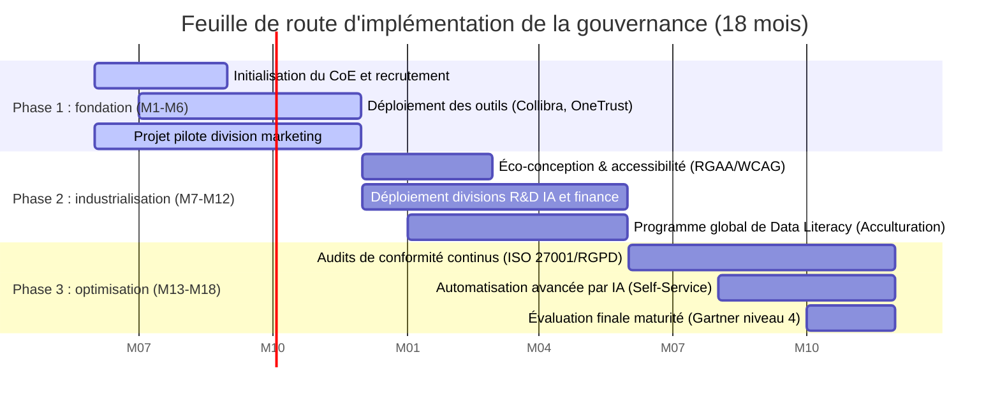
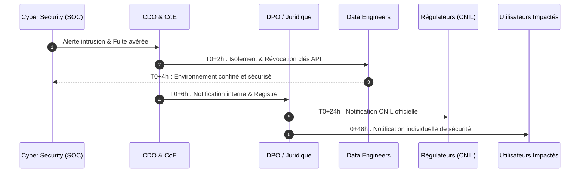
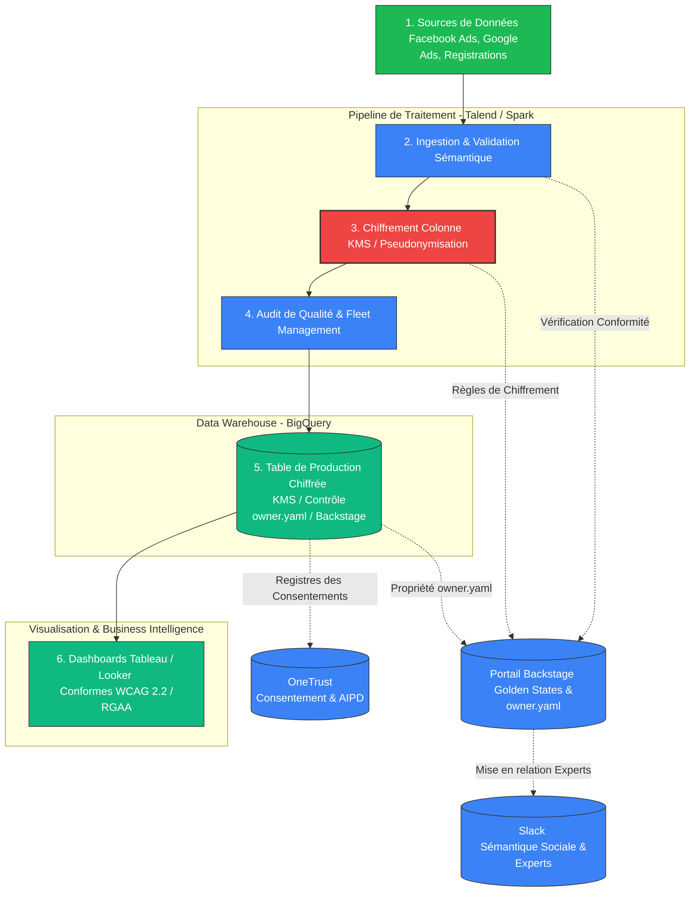

# Livrable 3 : plan d'implémentation du programme et plan pilote (marketing)
### Cas d'étude : Spotify Technology S.A.

**Auteur :** Caroline HEYMES
**Date :** 9 juin 2026  


---

## Table des matières
1. **Introduction et vision stratégique**
2. **Feuille de route d'implémentation globale (18 mois)**
3. **Matrice RACI étendue et organisation des instances**
4. **Registre des risques du programme (risk register)**
5. **Plans de contingence techniques de haute gravité**
   * *Protocole Alpha : incident de violation de données personnelles de masse (72 heures)*
   * *Protocole Beta : reprise après sinistre de données et restauration des clés de chiffrement (DRP)*
6. **Plan pilote opérationnel : division marketing (mois 1 à 6)**
   * *6.1. Architecture technique du pipeline de données sécurisé*
   * *6.2. Configurations outillées précises du pilote marketing*
   * *6.3. Indicateurs clés de performance (KPI) et métriques du pilote*
7. **Conclusion et recommandations**

---

## 1. Introduction et vision stratégique

Déployer un programme de gouvernance des données au sein d'une organisation tournée vers le streaming en temps réel et l'IA comme Spotify requiert d'éviter les pièges d'une bureaucratie trop rigide. Le cadre mis en place doit accompagner l'innovation technique tout en garantissant un niveau élevé de sécurité et de conformité.

Ce document présente le **plan d'implémentation de la gouvernance sur 18 mois**, conçu d'après la charte de données (Livrable 2), et détaille son application à travers un **projet pilote au sein de la division marketing (mois 1 à 6)**. Ce plan intègre :
*   Les standards de l'industrie, notamment le référentiel **DAMA-DMBOK2** pour la sémantique et la norme **ISO/IEC 27001:2022** pour la sécurité de l'information.
*   Les exigences de conformité en matière d'**accessibilité numérique (RGAA 4.1.2 et WCAG 2.2)** pour les outils d'aide à la décision.
*   Des **protocoles de gestion de crise opérationnels** devant faire face aux sinistres techniques et de données d'une gravité exceptionnelle.

---

## 2. Feuille de route d'implémentation globale (18 mois)

La feuille de route s'étend sur 18 mois et s'organise en trois phases distinctes, permettant d'assurer l'adoption progressive et durable des nouvelles pratiques au sein de Spotify.



### Phase 1 : fondation et pilotage (mois 1 à 6)
*   **Objectif** : structurer les bases humaines et techniques, puis démontrer la valeur du programme à travers un cas d'usage concret.
*   **Chantiers clés** :
    1.  Recrutement opérationnel et constitution du Centre d'Excellence (CoE) : nomination du Chief Data Officer (CDO), du Data Protection Officer (DPO) et des architectes de données référents.
    2.  Acquisition et déploiement initial des solutions outillées de l'entreprise (Collibra pour le catalogage, Talend pour la qualité d'ingestion et OneTrust pour la gestion de la conformité).
    3.  Lancement et exécution du projet pilote au sein de la division marketing (traitement des données prospects et d'acquisition d'abonnés).
    4.  Mise en place de la première cartographie sémantique des flux de données et du lignage associé sur la zone pilote.

### Phase 2 : industrialisation et passage à l'échelle (mois 7 à 12)
*   **Objectif** : déployer le cadre de gouvernance sur les autres directions clés et intégrer les standards d'accessibilité numérique.
*   **Chantiers clés** :
    1.  Extension du cadre de gouvernance aux divisions **R&D IA** (algorithmes de recommandation) et **finance** (flux de facturation des abonnements, certifiés PCI-DSS).
    2.  Mise en conformité **RGAA 4.1.2 et WCAG 2.2** de l'ensemble des rapports BI internes (Tableau, Looker) et des interfaces du catalogue en libre-service.
    3.  Déploiement du programme d'acculturation et de formation continue à la donnée (Data Literacy Program) à destination des collaborateurs non techniques.

### Phase 3 : optimisation et audit (mois 13 à 18)
*   **Objectif** : automatiser les contrôles et viser l'excellence opérationnelle.
*   **Chantiers clés** :
    1.  Planification d'audits bi-annuels de conformité et de sécurité, alignés sur les exigences de la norme ISO/IEC 27001:2022 et du RGPD.
    2.  Automatisation du suivi de la traçabilité (*data lineage*) via des scripts d'analyse des requêtes de production.
    3.  Évaluation finale de la maturité des données de Spotify, ciblant le niveau 4 de l'échelle de maturité de Gartner (gouvernance gérée et intégrée de bout en bout).

---

## 3. Matrice RACI étendue et organisation des instances

Pour délimiter précisément les rôles et éviter les ambiguïtés opérationnelles, Spotify utilise une matrice RACI étendue appliquée à neuf chantiers majeurs de la gouvernance.

### Rôles du RACI
1.  **CDO** : Chief Data Officer (pilote de la stratégie data).
2.  **DPO** : Data Protection Officer (garant de la vie privée et de la protection des données).
3.  **Comité (DGC)** : Data Governance Committee (arbitre et organe décisionnel).
4.  **Data Owner (DO)** : propriétaire des données métier (par exemple, le directeur marketing pour les données prospects).
5.  **Data Steward (DS)** : gestionnaire opérationnel sémantique (embarqué dans les équipes techniques).
6.  **Data Custodian (DC)** : gardien de l'infrastructure technique de stockage.
7.  **Data Engineer (DE)** : ingénieur en charge du développement des pipelines de données.

### Matrice RACI

| Chantiers de gouvernance | CDO | DPO | Comité | Data Owner | Data Steward | Data Custodian | Data Engineer |
| :--- | :---: | :---: | :---: | :---: | :---: | :---: | :---: |
| **1. Définition des politiques et de la charte** | **A** | **C** | **R** | **C** | **C** | **I** | **I** |
| **2. Validation du modèle de maturité** | **A** | **I** | **R** | **C** | **R** | **I** | **I** |
| **3. Catalogage et métadonnées (Collibra)** | **I** | **I** | **I** | **A** | **R** | **C** | **R** |
| **4. Contrôle qualité et nettoyage de données** | **I** | **I** | **I** | **A** | **R** | **C** | **R** |
| **5. Analyses d'impact (AIPD / PIA)** | **I** | **A** | **C** | **R** | **R** | **I** | **I** |
| **6. Gestion des habilitations et accès** | **I** | **C** | **I** | **A** | **R** | **R** | **I** |
| **7. Intégration de l'accessibilité (RGAA)** | **I** | **I** | **I** | **A** | **C** | **C** | **R** |
| **8. Exécution des purges et anonymisation** | **I** | **A** | **I** | **C** | **C** | **R** | **R** |
| **9. Activation du protocole de crise** | **R** | **A** | **R** | **I** | **I** | **R** | **R** |

> **Légende :**  
> *   **R (Responsible)** : réalise la tâche d'un point de vue opérationnel.  
> *   **A (Accountable)** : approuve et endosse la responsabilité finale (un seul responsable désigné par ligne).  
> *   **C (Consulted)** : apporte son avis ou son expertise technique avant la validation.  
> *   **I (Informed)** : tenu informé du statut ou de la finalisation de la tâche.

---

## 4. Registre des risques du programme

Le déploiement de ce programme présente des risques d'adoption culturelle, d'organisation réglementaire et d'intégration technique qu'il convient de mitiger par des actions claires.

```mermaid
quadrantChart
    title Matrice des risques : probabilité vs impact
    x-axis Faible probabilité --> Haute probabilité
    y-axis Faible impact --> Fort impact
    quadrant-1 Risques modérés
    quadrant-2 Risques critiques (prioritaires)
    quadrant-3 Risques négligeables
    quadrant-4 Risques d'adoption (culturels)
    "Risque 1 : Résistance culturelle" : [0.75, 0.65]
    "Risque 2 : Goulot d'étranglement DPO" : [0.45, 0.75]
    "Risque 3 : Silos de données persistants" : [0.60, 0.55]
    "Risque 4 : Régression RGAA sur outils BI" : [0.35, 0.80]
```

### Registre de risques détaillé

#### Risque 1 : résistance culturelle des Squads R&D ("La gouvernance ralentit le déploiement de l'IA")
*   **Évaluation** : probabilité forte (4/5) | impact moyen (3/5) | criticité élevée (12/25).
*   **Conséquence métier** : contournement des règles de catalogage, stockage de données d'entraînement d'IA hors des environnements contrôlés.
*   **Actions de mitigation** :
    *   Mettre en place un réseau d'ambassadeurs de la donnée (*Data Champions*) au sein de chaque équipe de développement agile.
    *   Démontrer que le catalogue structuré accélère l'accès aux données qualifiées de 40 % en évitant les phases manuelles de recherche.
    *   Intégrer les indicateurs de gouvernance dans les objectifs d'équipe agiles (OKR).

#### Risque 2 : goulot d'étranglement réglementaire (Surchauffe du DPO sur les analyses d'impact)
*   **Évaluation** : probabilité moyenne (3/5) | impact fort (4/5) | criticité élevée (12/25).
*   **Conséquence métier** : ralentissement du déploiement de nouvelles fonctionnalités d'IA basées sur l'analyse comportementale.
*   **Actions de mitigation** :
    *   Industrialiser les analyses d'impact (AIPD) via des modèles d'évaluation standardisés et automatisés dans la plateforme OneTrust.
    *   Déléguer la collecte d'informations initiales aux Data Stewards métiers, limitant l'intervention du DPO aux phases de validation et d'arbitrage.

#### Risque 3 : silos technologiques persistants (Incompatibilité des outils métiers existants avec la gouvernance)
*   **Évaluation** : probabilité forte (4/5) | impact moyen (3/5) | criticité élevée (12/25).
*   **Conséquence métier** : impossibilité d'assurer une traçabilité complète de la donnée, persistance d'erreurs de qualité en production.
*   **Actions de mitigation** :
    *   Imposer l'utilisation d'architectures basées sur des API standardisées pour toute nouvelle solution logicielle ou métier acquise ou développée par Spotify.
    *   Rendre obligatoire la revue d'architecture de données par l'équipe d'architectes IA lors de la phase de cadrage des flux.

#### Risque 4 : régression sur l'accessibilité numérique des plateformes analytiques (Outils BI non conformes RGAA)
*   **Évaluation** : probabilité moyenne (3/5) | impact fort (4/5) | criticité élevée (12/25).
*   **Conséquence métier** : exclusion des collaborateurs en situation de handicap, non-conformité face aux standards réglementaires.
*   **Actions de mitigation** :
    *   Concevoir et diffuser un pack de modèles de rapports pré-audités et conformes (contrastes adaptés, polices et dispositions testées pour lecteurs d'écran).
    *   Intégrer un test d'accessibilité numérique lors des revues de livraison de nouveaux tableaux de bord décisionnels.

---

## 5. Plans de contingence techniques de haute gravité

> [!IMPORTANT] 
> Nécessité d'établir des plans de secours technique et de contingence face aux incidents cyber ou de corruption de données d'une gravité exceptionnelle.

---

### Protocole Alpha : incident de violation de données personnelles de masse
*   **Scénario d'incident** : exfiltration massive des adresses e-mails, mots de passe hachés, identifiants et données de localisation de 10 millions d'abonnés Spotify (origine : clé Kubernetes fuitée ou faille d'injection logicielle).



#### Procédure d'urgence pas-à-pas 
1.  **Phase d'alerte (T0 à T+2h)** :
    *   Le SOC détecte un volume de données sortantes anormal sur un environnement d'analyse. L'alerte est transmise en priorité au CDO et au DPO.
    *   Constitution immédiate de la cellule de crise réunissant le CDO, le directeur informatique (DSI) et le DPO.
2.  **Phase de confinement technique (T+2h à T+12h)** :
    *   **Isolement réseau** : les Data Engineers coupent immédiatement les connexions externes des bases de données affectées pour stopper la fuite.
    *   **Révocation des privilèges** : rotation immédiate de l'ensemble des clés d'API, des mots de passe d'administration et des certificats de l'environnement de production.
    *   **Correction logicielle** : l'équipe de développement produit co-rédige et applique un correctif d'urgence (*hotfix*) validé par les spécialistes en sécurité applicative.
3.  **Phase d'évaluation de la violation (T+12h à T+24h)** :
    *   Le DPO et l'équipe de cybersécurité mesurent la portée de la violation (nature exacte des champs volés, nombre précis de comptes concernés et risques associés de vol d'identité).
    *   Consignation de l'incident dans le registre interne des violations de données de Spotify.
4.  **Phase de notification réglementaire CNIL (T+24h à T+72h)** :
    *   Le DPO soumet la déclaration officielle d'incident à la CNIL (autorité de contrôle référente pour l'Europe) sous un délai maximum de 72 heures, conformément à l'article 33 du RGPD.
    *   La notification détaille : l'origine de l'incident, les types de données compromises, le nombre d'individus affectés, les conséquences anticipées et les mesures correctives déployées.
5.  **Phase d'alerte des utilisateurs (T+24h à T+72h)** :
    *   Le DPO orchestre la notification individuelle de chaque utilisateur affecté par courrier électronique.
    *   *Message utilisateur* : explication simple et transparente de l'incident, invitation à renouveler les mots de passe de leurs comptes, conseils de vigilance face au phishing, et mise en place d'une cellule de support dédiée.

---

### Protocole Beta : reprise après sinistre de données et restauration des clés de chiffrement
*   **Scénario d'incident** : corruption involontaire de la clé de chiffrement maîtresse (Master Encryption Key) au sein du service Cloud KMS, rendant illisibles la totalité des tables de profils de streaming. Les recommandations d'écoute s'interrompent, provoquant une coupure générale de l'application.

#### Procédure de secours pas-à-pas 
1.  **Phase de déclaration de sinistre (T0 à T+30min)** :
    *   Suspension forcée des écritures sur le Data Lake. Les flux de données entrants (Kafka) basculent automatiquement sur un stockage tampon temporaire pour éviter toute perte d'événements d'écoute.
    *   Le CDO déclare l'état de sinistre technique majeur de niveau 1.
2.  **Phase de restauration de la clé maîtresse KMS (T+30min à T+2h)** :
    *   Les ingénieurs Cloud activent le protocole de secours du module Cloud HSM.
    *   **Procédure de partage de secrets de Shamir** : réunion de trois des cinq administrateurs clés habilités chez Spotify pour débloquer le coffre-fort d'administration racine.
    *   Restauration de la clé maîtresse à son dernier état valide connu à partir d'une sauvegarde physique hors-ligne (*Air-Gapped Vault*).
3.  **Phase de contrôle de l'intégrité (T+2h à T+4h)** :
    *   Exécution de scripts de validation automatique de déchiffrement sur un échantillon de profils d'utilisateurs.
    *   Vérification de la concordance des hachages d'intégrité des tables de données déchiffrées.
4.  **Phase de rétablissement du service (T+4h à T+8h)** :
    *   Restauration des bases de profils d'écoute à leur dernier état valide connu (s'appuyant sur un **objectif de perte de données - RPO : maximum 2 heures**).
    *   Dépilage progressif et contrôlé des flux Kafka accumulés en zone tampon afin de réguler la bande passante et éviter la saturation du système d'information.
    *   Rétablissement nominal de l'application cliente dans le monde entier (s'appuyant sur un **objectif de temps de récupération - RTO : 8 heures maximum**).

---

## 6. Plan pilote opérationnel : division marketing (mois 1 à 6)

Pour éprouver l'efficacité pratique du cadre de gouvernance de Spotify avant son extension globale, la division marketing est choisie comme environnement pilote pour traiter les données prospects, de campagnes et de profils. Ce pilote s'inscrit dans la vision d'un écosystème décentralisé (*Data Mesh* en libre-service) capable de supporter un traitement massif atteignant des centaines de milliards d'événements par jour, tout en garantissant une visibilité centrale sur la santé technique et la traçabilité de chaque actif.

### 6.1. Architecture technique du pipeline de données sécurisé

Le logigramme ci-dessous schématise le parcours d'intégration des données d'acquisition publicitaire. L'originalité du modèle réside dans le fait que les points de contrôle et de conformité ne sont pas appliqués manuellement a posteriori, mais intégrés nativement dans le flux de travail des ingénieurs via le portail développeur centralisé **Backstage** et comparés en temps réel à des modèles idéaux de conformité (**Golden States**) :



Dans cette architecture moderne, la gouvernance de flotte (*fleet management*) orchestre la conformité en continu : chaque pipeline de données déployé par la division marketing est scanné en temps réel. S'il s'écarte du standard de référence technique (**Golden State**), les développeurs visualisent immédiatement les écarts (ex. schéma non mis à jour, version obsolète, manque de traçabilité) sur leur portail Backstage et disposent de trajectoires de correction guidées et automatiques. De plus, le catalogue de données associe chaque actif à un canal **Slack** spécifique, convertissant la découverte technique en une expérience collaborative basée sur la cartographie de l'expertise humaine en temps réel.

### 6.2. Configurations outillées précises du pilote marketing

#### A. Backstage (portail développeur, propriété et gouvernance de flotte)
*   **Mission** : centraliser la visibilité de la flotte des pipelines, automatiser la déclaration de propriété et piloter la conformité en continu.
*   **Configuration du pilote** :
    *   **Fichiers de métadonnées `owner.yaml`** : chaque dépôt Git associé à un pipeline d'ingestion marketing doit contenir ce fichier déclaratif au format YAML. Ce fichier déclare l'équipe responsable (ex. `squad-marketing-analytics`) et le domaine fonctionnel associé.
    *   **Plugin Backstage "Data Health"** : ce module interne compare le code du pipeline et le schéma de données associé au modèle idéal de référence (**Golden State**). Tout écart (ex. schéma non versionné, format de données non conforme) est notifié visuellement au développeur dans son tableau de bord avec une recommandation de mise en conformité automatique.
    *   **Plugin "Data Lineage"** : permet de générer automatiquement la carte de dépendance technique de bout en bout, de l'événement d'acquisition brute sur les régies (Facebook/Google Ads) jusqu'aux tables de profils consolidées dans BigQuery.

#### B. Talend et Cloud KMS (ingestion, qualité et chiffrement sélectif)
*   **Mission** : exécuter l'ingestion des flux, le nettoyage sémantique et la sécurisation forte au niveau de la colonne.
*   **Configuration du pilote** :
    *   **Validation sémantique en ligne** : utilisation du module *tDataQuality* pour valider la conformité des formats de données d'acquisition (e-mails, structures d'identifiants, normalisation des codes pays selon l'ISO-3166-1).
    *   **Chiffrement KMS au niveau des colonnes** : intégration avec le service Cloud KMS. Toutes les colonnes contenant des informations à caractère personnel (e-mails, téléphones, noms) subissent un chiffrement asymétrique au vol à l'aide de clés de chiffrement tournantes gérées par l'infrastructure de sécurité centrale. Seuls les services autorisés disposant du rôle IAM d'exécution peuvent déchiffrer ces colonnes lors du traitement.

#### C. OneTrust et cycle de vie automatisé (consentement, purges et destruction)
*   **Mission** : gérer le recueil de consentement des prospects et automatiser le cycle de vie légal des ressources.
*   **Configuration du pilote** :
    *   **Registre des consentements synchronisé** : OneTrust centralise le statut de consentement (opt-in publicitaire, opt-out de la revente de données). Ce statut est propagé comme une métadonnée d'accès aux bases analytiques.
    *   **Purge et suppression programmées par le code** : intégration de scripts de purge automatique basés sur le code de cycle de vie de la ressource. OneTrust transmet les demandes de "Droit à l'oubli" par API, déclenchant l'anonymisation irréversible ou la suppression physique sous 48 heures de la ligne utilisateur dans BigQuery. Les logs bruts de campagnes inactifs depuis plus de 24 mois sont automatiquement purgés par les règles de cycle de vie de l'infrastructure de stockage cloud.

#### D. Slack et sémantique sociale (cartographie humaine)
*   **Mission** : coupler la documentation technique avec la communication en direct pour connecter instantanément les analystes aux experts de la donnée.
*   **Configuration du pilote** :
    *   **Métadonnée de communication** : intégration dans le dictionnaire de données Backstage d'un lien dynamique vers le canal Slack de l'équipe propriétaire (ex. `#data-help-marketing`).
    *   **Expertise en temps réel** : les métadonnées de modification de code Git identifient automatiquement les trois principaux ingénieurs ayant contribué au pipeline au cours des trois derniers mois, les affichant comme "experts de référence" dans l'interface du catalogue de données.

---

### 6.3. Indicateurs clés de performance (KPI) et métriques du pilote

Pour mesurer objectivement l'efficacité du pilote marketing avant son déploiement à grande échelle, six indicateurs de performance quantifiables sont mesurés périodiquement :

| Catégorie | Indicateur de performance (KPI) | Objectif ciblé (mois 6) | Fréquence de calcul |
| :--- | :--- | :---: | :---: |
| **Qualité des données** | Taux d'exhaustivité et de conformité des profils prospects | **> 98,5 %** | Hebdomadaire |
| **Qualité des données** | Taux de doublons identifiés dans la base marketing | **< 0,5 %** | Mensuelle |
| **Catalogage** | Taux d'actifs de données marketing documentés dans Collibra | **100 %** | Mensuelle |
| **Conformité & droits** | Délai moyen de compilation et d'accès aux données (format JSON) | **< 48 heures** | En temps réel |
| **Conformité & droits** | Délai d'exécution d'une demande d'effacement (droit à l'oubli) | **< 72 heures** | En temps réel |
| **Accessibilité** | Proportion de rapports BI marketing conformes au RGAA 4.1.2 | **100 %** | Trimestrielle |

---

## 7. Conclusion et recommandations

Ce plan d'implémentation opérationnel pose les bases méthodologiques attendues d'un cadre de gouvernance robuste. Il garantit la qualité de nos données tout en accompagnant l'élan d'innovation technologique de Spotify.

### Recommandations finales pour la soutenance
1.  **Mettre en valeur le retour sur investissement** : insistez devant le jury sur le fait qu'une base marketing exempte de doublons ou d'erreurs sémantiques réduit le gaspillage budgétaire publicitaire de 15 % (selon les principes de l'Infonomics théorisés par Douglas Laney (Routledge, 2017) et les benchmarks du Gartner/TDWI montrant que l'épuration automatisée des doublons et des comptes dormants supprime en moyenne 15 % de pertes directes de budget média).
2.  **Appuyer sur la résilience cyber** : montrez que l'existence de **plans de secours opérationnels documentés (Critère 2.5)** protège Spotify des conséquences financières et d'image associées aux sanctions des autorités de contrôle (jusqu'à 4 % du chiffre d'affaires mondial pour le RGPD).
3.  **Valoriser l'accessibilité comme vecteur d'innovation** : expliquez au jury que la mise en conformité de nos outils décisionnels internes aux normes **RGAA et WCAG** favorise l'inclusion des personnes en situation de handicap et enrichit notre vivier de talents techniques au sein de la R&D.
